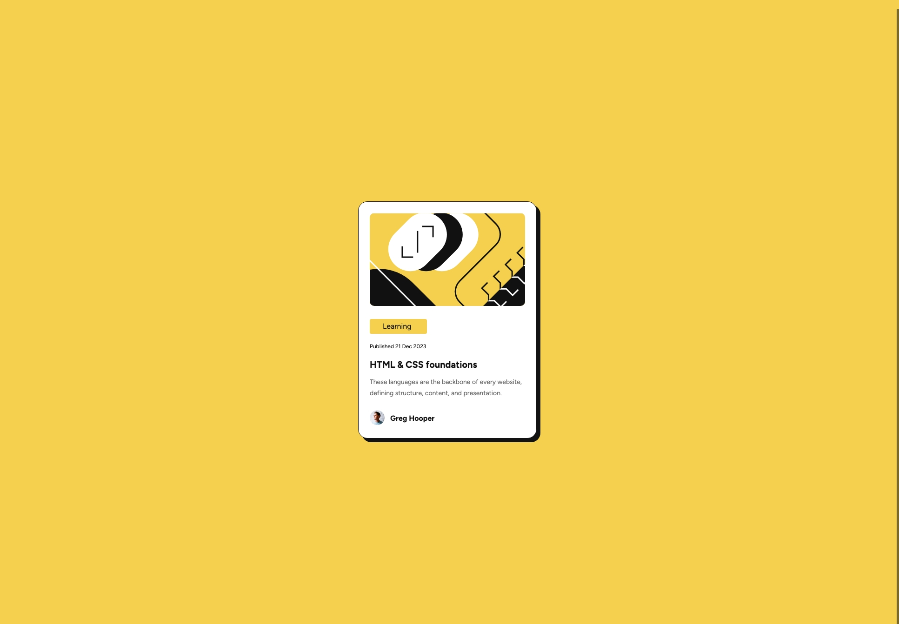
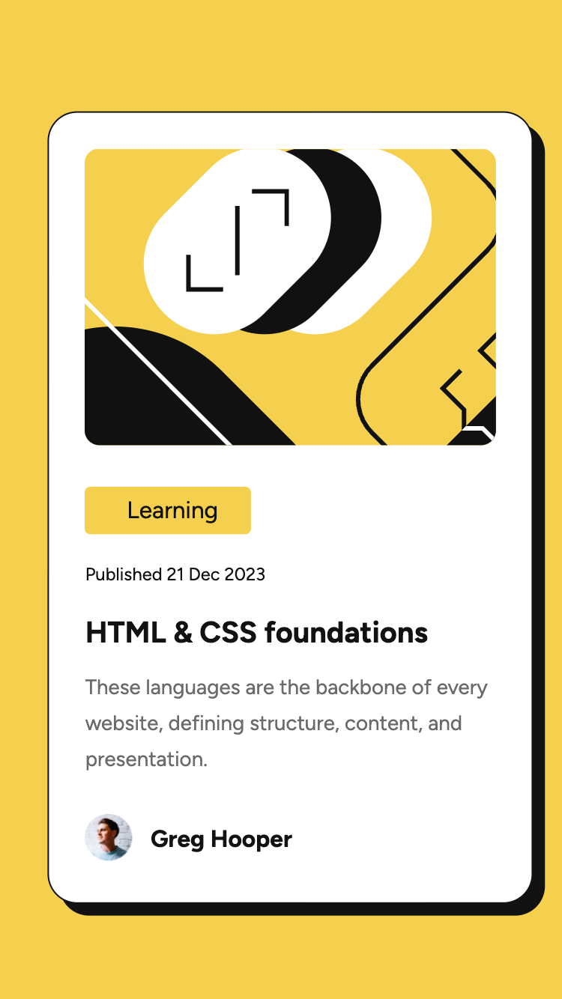
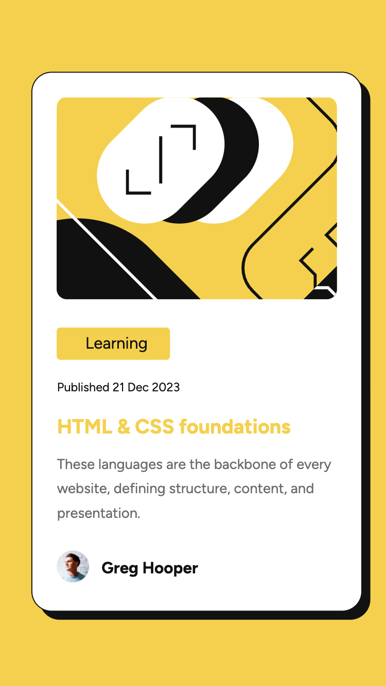

# Frontend Mentor - Blog preview card solution

This is a solution to the [Blog preview card challenge on Frontend Mentor](https://www.frontendmentor.io/challenges/blog-preview-card-ckPaj01IcS). Frontend Mentor challenges help you improve your coding skills by building realistic projects. 

## Table of contents

- [Overview](#overview)
  - [The challenge](#the-challenge)
  - [Screenshots](#screenshots)
  - [Links](#links)
- [My process](#my-process)
  - [Built with](#built-with)
  - [What I learned](#what-i-learned)
  - [Continued development](#continued-development)
  - [Useful resources](#useful-resources)
- [Author](#author)

**Note: Delete this note and update the table of contents based on what sections you keep.**

## Overview

### The challenge

Users should be able to:

- See hover and focus states for all interactive elements on the page

### Screenshots

### Screenshots





### Links

- Solution URL: [GitHub Repo](https://github.com/tmelnychenko/blog-preview-card)
- Live Site URL: [GitHub Pages - Blog Preview Card](https://tmelnychenko.github.io/blog-preview-card)

## My process

### Built with

- Semantic HTML5 markup
- CSS custom properties
- CSS variables
- Flexbox
- Mobile-first workflow

### What I learned

I learned how to use variables in CSS and used them for site colors.

```css
:root {
    --primary-color: hsl(47, 88%, 63%);
    --secondary-color: hsl(0, 0%, 7%);
    --article-color: hsl(0, 0%, 42%);
    --white-color: hsl(0, 0%, 100%);
}

body {
    background-color: var(--primary-color);
}

h1 {
    color: var(--secondary-color);
}

article {
    color: var(--article-color)
}
```

I leaned how to use modern picture format webp

```html
      <picture>
        <source srcset="./assets/images/image-avatar.webp" type="image/webp">
        <source srcset="./assets/images/image-avatar.jpg" type="image/jpeg">
        
      </picture>
```

### Continued development

I will focus on building resposive designs, using Flexbox and have structured CSS themes using CSS variables

### Useful resources

- [SVG Intro](https://www.w3schools.com/graphics/svg_intro.asp) and [SVG <image>](https://www.w3schools.com/graphics/svg_image.asp) - This helped me to refresh knowledge of how to use SVG images on the webpage.
- [How to scale SVG](https://css-tricks.com/scale-svg) - good article about scaling SVG

## Author

- Frontend Mentor - [@tmelnychenko](https://www.frontendmentor.io/profile/tmelnychenko)